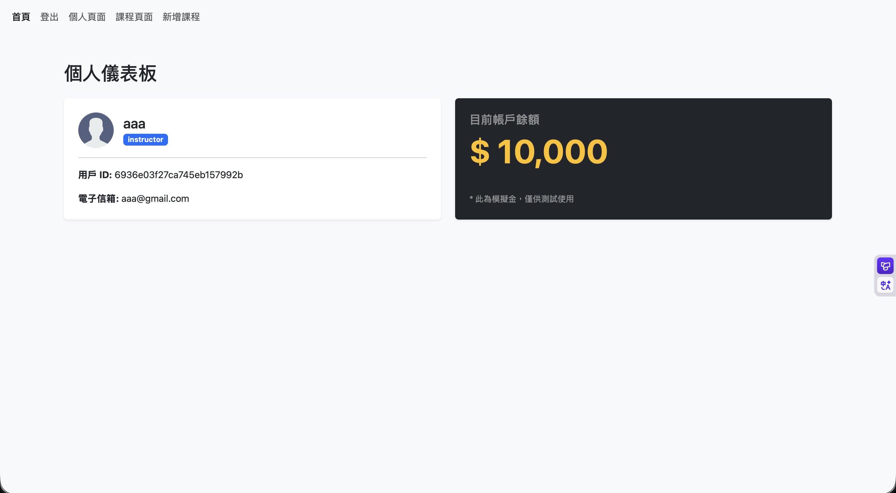
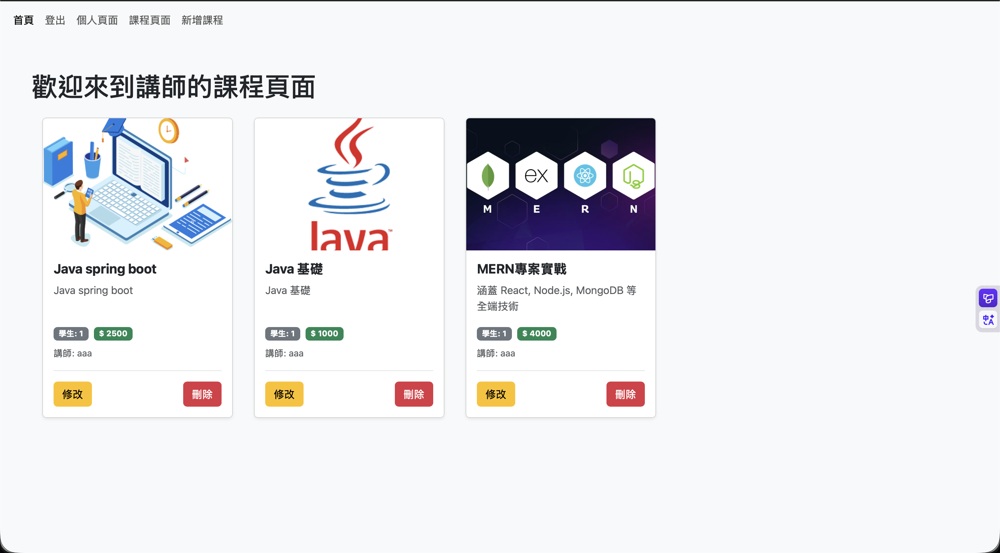
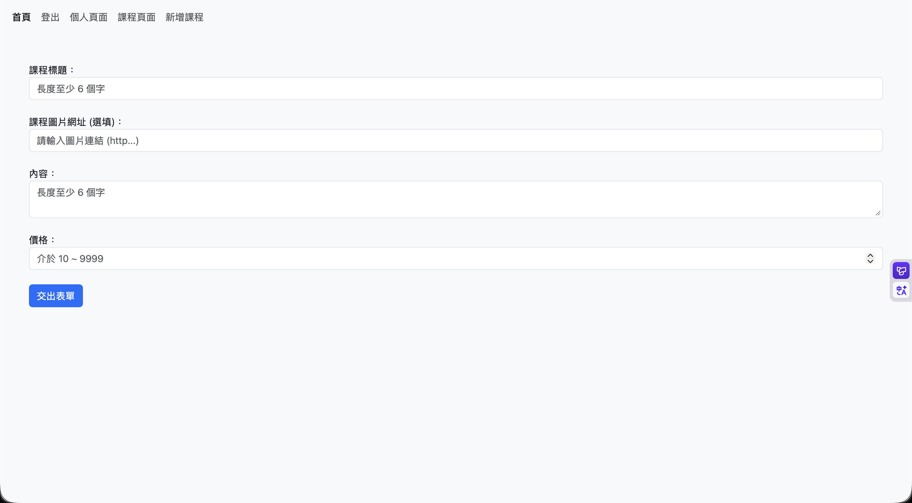
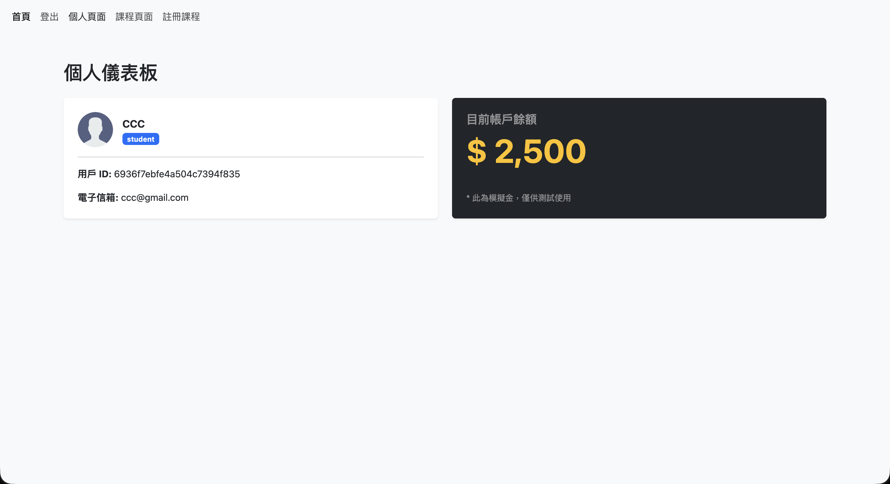
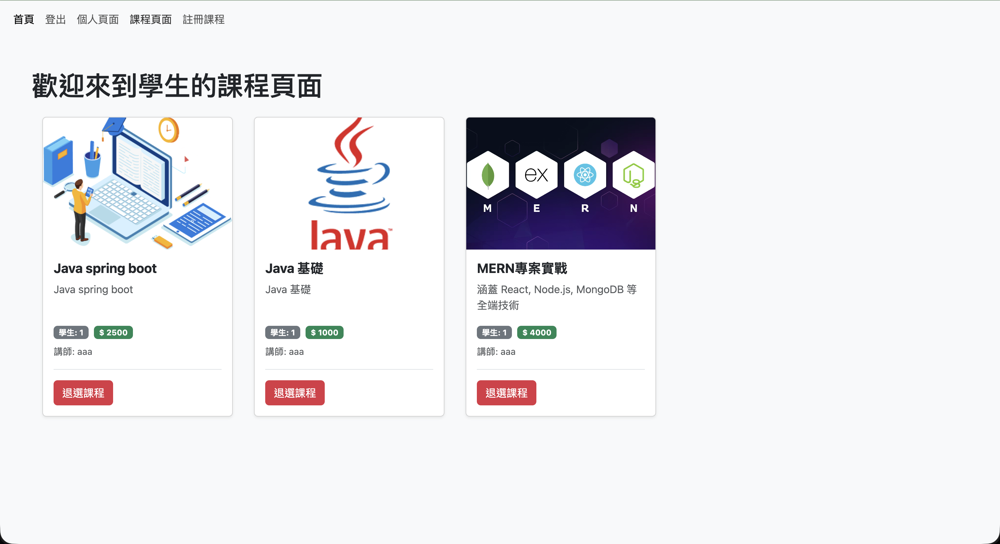
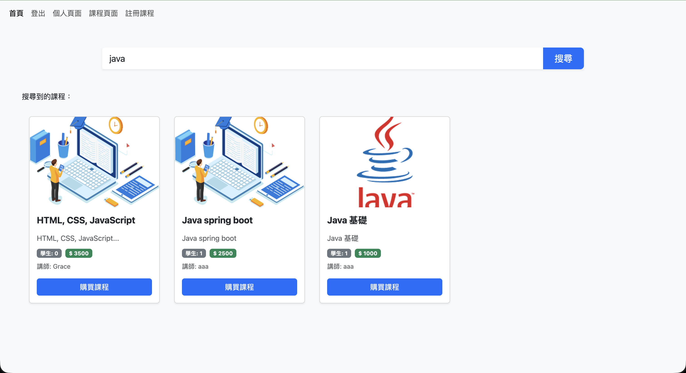

# 🎓 MERN Online Learning Platform (線上課程學習系統)


這是一個全端的線上課程平台，使用 **MERN Stack** (MongoDB, Express, React, Node.js) 開發。
專案模擬了真實的教學平台運作，包含完整的會員系統、角色權限區分、課程管理以及虛擬金流交易功能。

## ✨ 主要功能 (Key Features)

### 👥 角色與權限系統 (Role-Based Access Control)

- **學生 (Student):**
  - 擁有預設 **$10,000** 模擬金。
  - 可以搜尋課程 (支援模糊搜尋)。
  - 購買/註冊課程 (系統自動扣款)。
  - 退選課程 (系統自動退款至帳戶餘額)。
  - 查看個人儀表板與已註冊課程。
- **講師 (Instructor):**
  - 擁有開設新課程的權限。
  - 管理自己開設的課程 (新增、編輯、刪除)。
  - 查看課程目前的註冊人數。

### 💰 模擬交易系統 (Simulated Transaction)

- 實作完整的「購買 -> 扣款 -> 退選 -> 退款」邏輯。
- 後端嚴格驗證餘額是否充足，防止超額購買。
- 即時更新前端使用者餘額顯示。

### 🔐 安全性 (Security)

- 使用 **Passport.js + JWT** 進行使用者認證。
- 密碼使用 **bcrypt** 進行加密儲存。
- 路由受保護 (Protected Routes)，確保未登入者無法存取敏感頁面。

---

## 🛠️ 技術棧 (Tech Stack)

### Frontend (前端)

- **React.js** (Vite 建置)
- **React Router v6** (頁面導航)
- **Axios** (API 請求)
- **Bootstrap 5** (UI 樣式與響應式設計)

### Backend (後端)

- **Node.js & Express.js** (伺服器框架)
- **MongoDB & Mongoose** (資料庫模型)
- **Passport.js & JWT** (身份驗證策略)
- **Joi** (資料驗證)

---

## 📸 畫面截圖 (Screenshots)

|           首頁 (Home)           |    講師個人頁面 (Instructor Profile)     |
| :-----------------------------: | :--------------------------------------: |
|  |  |

|          講師課程列表 (Instructor Courses)           |         新增課程 (Post New Course)          |
| :--------------------------------------------------: | :-----------------------------------------: |
|  |  |

|    學生個人頁面 (Student Profile)     |        學生已註冊課程 (Enrolled Courses)         |
| :-----------------------------------: | :----------------------------------------------: |
|  |  |

|     課程搜尋 (Course Search)     |     |
| :------------------------------: | :-: |
|  |     |

---

## 🚀 如何執行 (Getting Started)

請依照以下步驟在你的本地環境執行此專案。

### 1. Clone 專案

```bash
git clone [https://github.com/Hsiu0308/mern-course-platform.git](hhttps://github.com/Hsiu0308/mern-course-platform.git)
cd mern-course-platform
```
